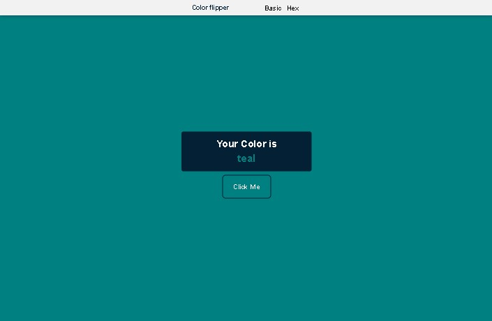

# Color Flipper

This is a Color Flipper built with the help of [Vanilla JavaScript Course](https://www.youtube.com/watch?v=3PHXvlpOkf4). from the FreeCodeCamp Channel

I watched the course and tried to re build it by myself with some changes

## Overview

### The challenge

Users should be able to:

- choose the type of flipper from the nav bar:
  --'Basic' generates a random color from the 16 basic colors : "black", "white", "gray", "silver", "maroon", "red", "purple", "fushsia", "green", "lime", "olive", "yellow", "navy", "blue", "teal"

  -- 'Hex' Generate a random color in Hex form.

- See hover states for all interactive elements on the page

### Screenshot

### Links

- [Live Site URL](https://husamasaad.github.io/Color_Flipper/)
